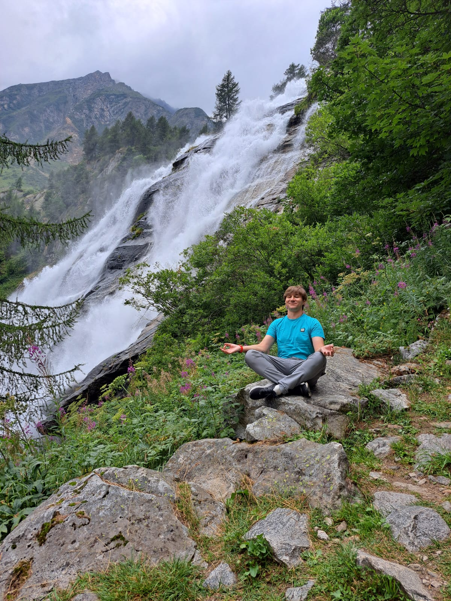

# Nice to meet you, I'm Vladimir Rukavishnikov 👋
Programmer and economist. I am interested in everything that I can take on and constantly improve my professional skills in languages and their frameworks. Despite the lack of an official profile education in programming, I am engaged in self-study.

# 🤔 Codewars
Codewars is an educational community for computer programming. On the platform, software developers are trained to program tasks known as kata.
It's a cool website where you face challenges and you get leveled by how good you do. It has all possible languages for training.

# 📧 Contacts

   
   
   
   

   📫 How to reach me: <a href='vladimirrukavishnikovmail@gmail.com'>vladimirrukavishnikovmail@gmail.com</a>

## 💬 Languages
*   English - B2
*   Spanish - A1
*   Russian - native language

## 🛠 Technical Stack
*   Python, JavaScript, Visual Basic languages
*   F# language
*   HTML, CSS
*   SQL
*   Django, Matplotlib, Pandas, NumPy, Keras, TensorFlow, Jupyter Notebook
*   I repair and modify old and new PCs and laptops.

## 🖥️ Project
* Improving the methodology for assessing the effectiveness of planning regional expenditures (on the example of the budgets of the subjects of the Volga Federal District)
  + The methodology for evaluating the efficiency of spending planning in the constituent entities of the Russian Federation has been improved

## 👨‍🎓 Education
* Kalashnikov Izhevsk State Technical University (ISTU)
  + Bachelor, Economics
  + Magister, Finance and credit
* Perm National Research Polytechnic University (PNRPU)
  + 1C: Accounting
* The Rolling Scopes School (RS School)
  + JS/FE pre-school 2022Q2 (JavaScript)

## 📊 My statistics

🔥 Streak stats

  
  

📈 Language&nbsp;/&nbsp;Framework stats

📊 Recent GitHub Activity

  

